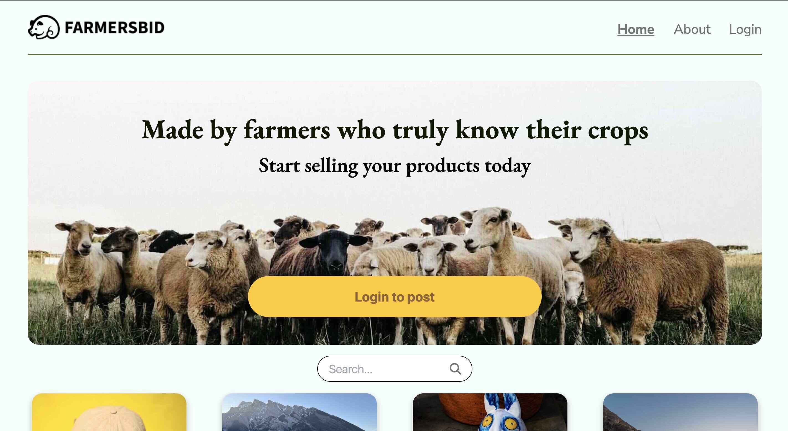

# Semester-Project2 - Auction Website

This is a semester project, which is part of my front-end development studies at Noroff. The task was to create an auction website with the possibility to create an account and bid with credits provided during the registration. Using all knowledge from last 3 semsters and creating a working prototype.



Explore the website by visiting the link - [FarmersBid](https://semester-project-two.netlify.app/)

## Key Features

- User can register with a stud.noroff.no email account
- User can login with registered account and password
- User can view the listings without having to login
- User can search through listings
- Logged in user can view profile
- Logged in user can edit profile data
- Logged in user can view their credit amount
- Logged in user can place a bid on another users listing
- Logged in user can view their expired, won, active bid and their listings
- Logged in user can loggout

## Built With

- Visual Studio Code

## Tech Stack

- HTML5 (HTML)
- Tailwind (CSS)
- JavaScript (Language)
- Netlify (Hosting)
- Hotjar (User tracking)

## Getting Started

### Prerequisites

- npm

### Installing:

1. Clone the repo:

```bash
git clone https://github.com/Nikita-stud/Portfolio](https://github.com/Nikita-stud/Semester-Project2
```

2. Install the dependencies:

```bash
npm install
```

### Running

To run the app, run the following commands:

```bash
npm run start
```

## Available Scripts

- `npm run dev` - Watches for changes and puts Tailwind in development mode
- `npm run build` - Minifies Tailwind CSS after production

### Script Details

```json
  "scripts": {
    "dev": "npx tailwindcss -i ./css/input.css -o ./css/style.css --watch",
    "build": "npx tailwindcss -i ./css/input.css -o ./css/style.css --minify"
  },

## Contact

You can always contact me though email or my phone number.

nikita151998@gmail.com
<br>
+4745588474
```
